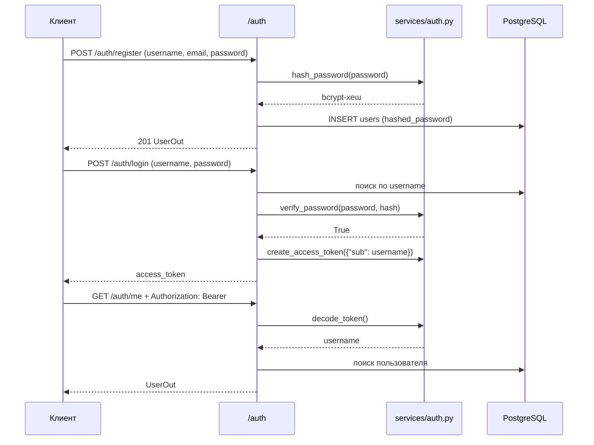

# Аутентификация и JWT

## Общая схема



## Хеширование паролей

```python title="app/services/auth.py"
pwd_context = CryptContext(schemes=["bcrypt"], deprecated="auto")


def hash_password(password: str) -> str:
    return pwd_context.hash(password)


def verify_password(plain: str, hashed: str) -> bool:
    return pwd_context.verify(plain, hashed)
```

- Хеширование **одностороннее**: из хеша нельзя восстановить пароль. При утечке базы пароли пользователей остаются в безопасности
- **bcrypt** специально медленный (порядка 100 мс на хеш) - для одного логина незаметно, для перебора миллионов вариантов неприемлемо
- **Соль** генерируется автоматически и хранится внутри хеша - одинаковые пароли дают разные хеши
- `verify_password()` хеширует введённый пароль с той же солью и сравнивает хеши. Сравнить пароль с хешем напрямую невозможно

## JWT-токен

Токен состоит из трёх частей, разделённых точками:

| Часть | Содержимое |
|-------|------------|
| Header | Алгоритм подписи (`HS256`) |
| Payload | Данные: `sub` (username) и `exp` (время истечения) |
| Signature | Подпись, вычисленная с помощью `SECRET_KEY` |

Payload не зашифрован и читается кем угодно, но изменить его без знания `SECRET_KEY` нельзя - подпись перестанет сходиться.

### Генерация

```python title="app/services/auth.py"
def create_access_token(data: dict, expires_delta: Optional[timedelta] = None) -> str:
    to_encode = data.copy()
    expire = datetime.utcnow() + (expires_delta or timedelta(minutes=settings.access_token_expire_minutes))
    to_encode["exp"] = expire
    return jwt.encode(to_encode, settings.secret_key, algorithm=settings.algorithm)
```

### Проверка

```python title="app/services/auth.py"
def decode_token(token: str) -> Optional[TokenData]:
    try:
        payload = jwt.decode(token, settings.secret_key, algorithms=[settings.algorithm])
        username: str = payload.get("sub")
        if username is None:
            return None
        return TokenData(username=username)
    except JWTError:
        return None
```

`jwt.decode()` одновременно проверяет подпись и срок действия. Любая ошибка приводит к `None`, а затем к ответу 401.

## Получение текущего пользователя

```python title="app/services/dependencies.py"
oauth2_scheme = OAuth2PasswordBearer(tokenUrl="/auth/login")


def get_current_user(
    token: str = Depends(oauth2_scheme),
    db: Session = Depends(get_db),
) -> User:
    credentials_exception = HTTPException(
        status_code=status.HTTP_401_UNAUTHORIZED,
        detail="Could not validate credentials",
        headers={"WWW-Authenticate": "Bearer"},
    )
    token_data = decode_token(token)
    if token_data is None:
        raise credentials_exception
    user = get_user_by_username(db, token_data.username)
    if user is None:
        raise credentials_exception
    return user
```

1. `oauth2_scheme` извлекает токен из заголовка `Authorization: Bearer ...` и добавляет кнопку **Authorize** в Swagger
2. `decode_token()` проверяет подпись и срок
3. Пользователь ищется в базе - на случай, если он был удалён после выдачи токена

Функция подключается через `Depends(get_current_user)` во **всех** защищённых эндпоинтах. Если токен неверный, тело эндпоинта не выполняется.

## Эндпоинты пользователя

| Метод | Путь | Токен | Описание |
|-------|------|-------|----------|
| POST | `/auth/register` | нет | Регистрация |
| POST | `/auth/login` | нет | Вход, выдача JWT |
| GET | `/auth/me` | да | Информация о текущем пользователе |
| GET | `/auth/users` | да | Список пользователей |
| PATCH | `/auth/me/password` | да | Смена пароля, требует старый пароль |

!!! tip "Безопасность сообщений об ошибках"
    При неудачном входе возвращается одинаковое сообщение `Incorrect username or password` и для несуществующего пользователя, и для неверного пароля. Так нельзя выяснить, зарегистрирован ли конкретный логин.
