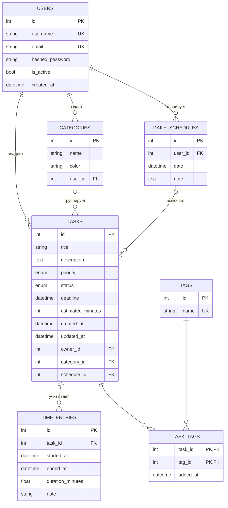

# Модель данных

## ER-диаграмма

## Таблицы

В модели **7 таблиц** - требование "5 или больше" выполнено.

| Таблица | Назначение |
|---------|------------|
| `users` | Пользователи системы. Пароль хранится только в виде хеша |
| `categories` | Категории задач, у каждой свой цвет и владелец |
| `tags` | Теги для гибкой разметки задач |
| `tasks` | Задачи с приоритетом, статусом и дедлайном |
| `task_tags` | Ассоциативная сущность связи задач и тегов |
| `time_entries` | Записи о времени, затраченном на задачу |
| `daily_schedules` | Расписания работы на конкретный день |

## Перечисления

Поля приоритета и статуса ограничены фиксированным набором значений через `Enum`. Это защищает от произвольных строк в базе и упрощает фильтрацию.

| Enum | Значения |
|------|----------|
| `Priority` | `low`, `medium`, `high`, `critical` |
| `TaskStatus` | `pending`, `in_progress`, `done`, `cancelled` |

## Связи one-to-many

Реализуются одной колонкой-внешним ключом на стороне "многих".

| Связь | Внешний ключ | Обязательность | При удалении родителя |
|-------|--------------|----------------|-----------------------|
| User → Tasks | `tasks.owner_id` | обязательно | `CASCADE` |
| User → Categories | `categories.user_id` | обязательно | `CASCADE` |
| User → DailySchedules | `daily_schedules.user_id` | обязательно | `CASCADE` |
| Category → Tasks | `tasks.category_id` | необязательно | `SET NULL` |
| DailySchedule → Tasks | `tasks.schedule_id` | необязательно | `SET NULL` |
| Task → TimeEntries | `time_entries.task_id` | обязательно | `CASCADE` |

!!! note "Почему разное поведение при удалении"
    Удаление пользователя должно удалять все его данные - иначе в базе останутся "ничьи" записи. А удаление категории не должно уничтожать задачи: у них просто обнуляется ссылка на категорию.

## Связь many-to-many

Задача может иметь несколько тегов, и один тег может быть у нескольких задач. Одной колонкой такую связь хранить нельзя - в неё помещается только одна ссылка. Поэтому используется отдельная таблица `task_tags`, где каждая строка - это одна связь.

Пример данных:

| task_id | tag_id | added_at |
|---------|--------|----------|
| 1 | 5 | 2024-01-01 10:00 |
| 1 | 7 | 2024-01-01 10:05 |
| 2 | 5 | 2024-01-02 09:00 |

Задача 1 имеет теги 5 и 7, тег 5 используется в задачах 1 и 2.

## Ассоциативная сущность

`task_tags` содержит, помимо ссылок `task_id` и `tag_id`, поле **`added_at`** - момент, когда тег был прикреплён к задаче.

Это поле нельзя перенести ни в `tasks`, ни в `tags`: оно описывает не задачу и не тег по отдельности, а **факт их связи**.

Первичный ключ таблицы составной - `(task_id, tag_id)`. Благодаря этому база не позволит прикрепить один и тот же тег к задаче дважды.
