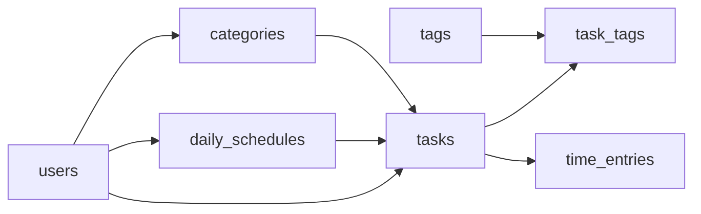

# Миграции Alembic

## Зачем нужны миграции

Миграция - это описанный в коде шаг изменения схемы базы данных с возможностью отката.

Альтернатива - `Base.metadata.create_all()` - умеет только создавать отсутствующие таблицы. Изменить существующую таблицу с данными (например, добавить колонку) она не может. Миграции решают эту задачу, сохраняя данные.

## Настройка env.py

```python title="alembic/env.py"
sys.path.insert(0, os.path.abspath(os.path.join(os.path.dirname(__file__), "..")))

from app.config import settings
from app.database import Base
import app.models.models

config = context.config
config.set_main_option("sqlalchemy.url", settings.database_url)

target_metadata = Base.metadata
```

- Адрес базы берётся из `settings`, а не дублируется в `alembic.ini` - он хранится в одном месте, в `.env`
- Импорт `app.models.models` регистрирует модели в `Base.metadata` - без него Alembic не увидит таблицы
- `target_metadata` используется командой `--autogenerate` для сравнения моделей с реальной схемой

## Начальная миграция

```python title="alembic/versions/001_initial.py"
revision: str = "001_initial"
down_revision: Union[str, None] = None
```

Первая миграция в цепочке. У следующей в `down_revision` будет указано `"001_initial"`.

### upgrade()

Создаёт 7 таблиц в порядке зависимостей:



Таблица создаётся только после тех, на которые она ссылается - внешний ключ на несуществующую таблицу создать нельзя.

```python title="alembic/versions/001_initial.py"
op.create_table(
    "task_tags",
    sa.Column("task_id", sa.Integer(), nullable=False),
    sa.Column("tag_id", sa.Integer(), nullable=False),
    sa.Column("added_at", sa.DateTime(), nullable=False, server_default=sa.func.now()),
    sa.ForeignKeyConstraint(["task_id"], ["tasks.id"], ondelete="CASCADE"),
    sa.ForeignKeyConstraint(["tag_id"], ["tags.id"], ondelete="CASCADE"),
    sa.PrimaryKeyConstraint("task_id", "tag_id"),
)
```

### downgrade()

Удаляет таблицы в обратном порядке - от зависимых к независимым - и затем удаляет enum-типы `priority` и `taskstatus`.

## Как Alembic отслеживает состояние

В базе создаётся служебная таблица `alembic_version` с номером последней применённой миграции. При `upgrade head` Alembic применяет только те миграции, которых ещё нет.

## Команды

| Команда | Действие |
|---------|----------|
| `python -m alembic upgrade head` | Применить все миграции |
| `python -m alembic downgrade -1` | Откатить последнюю |
| `python -m alembic current` | Текущая версия БД |
| `python -m alembic history` | Список миграций |
| `python -m alembic revision --autogenerate -m "описание"` | Сгенерировать новую миграцию по изменениям моделей |

## Пример изменения схемы

Чтобы добавить в задачу поле `is_favorite`:

1. Добавить поле в модель `Task` в `models/models.py`
2. Выполнить `python -m alembic revision --autogenerate -m "add is_favorite to task"`
3. Проверить сгенерированный файл в `alembic/versions/`
4. Выполнить `python -m alembic upgrade head`

Существующие данные при этом сохраняются.
